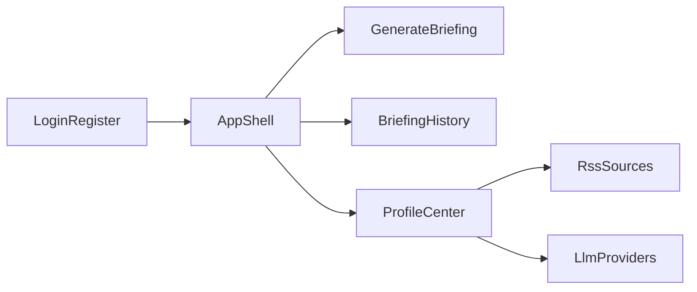
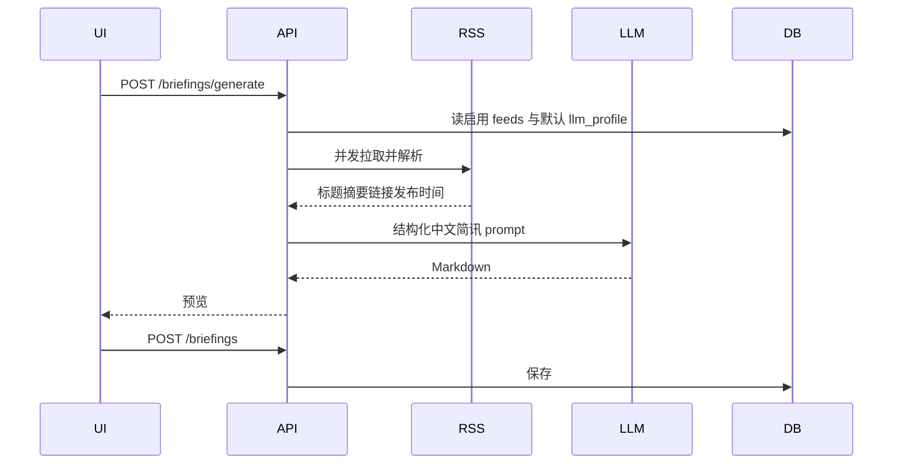

# Cat & News 最小闭环实施方案

产品定位：个人向「RSS → 大模型 → 每日 AI 简讯」工作台。仓库目录即项目根（[`/Users/james/Project/cat-and-news`](/Users/james/Project/cat-and-news)），当前几乎为空，按绿场初始化。

## 技术拍板

- **运行时**：Node 22 LTS，包管理器 **pnpm**
- **前端**：Next.js App Router（`create-next-app@latest`，实现时再核版本）+ Tailwind CSS v4 + shadcn/ui + lucide-react + `next-themes`
- **接口**：仅 Route Handlers，路径统一 `/api/v1/*`；**禁止 Server Actions**
- **认证**：Better Auth（邮箱密码 + GitHub + Google），入口 `/api/auth/[...all]`
- **数据**：Drizzle ORM + Neon PostgreSQL（运行时用池化 WebSocket `Pool`，迁移用直连 URL）
- **RSS**：`@rowanmanning/feed-parser`（服务端 `fetch` 后再解析）
- **Markdown 预览**：`react-markdown` + `remark-gfm`（不加 `rehype-raw`）
- **校验**：Zod；提示：`sonner`
- **大模型**：个人中心可配置厂商 / Base URL / 模型 / API Key；服务端抽象成 OpenAI 兼容与 Anthropic 两套适配器

不采用 Auth.js v5（仍 beta）和 Clerk（身份数据不落本库）。

## 信息架构与页面



- 未登录：[`/login`](<src/app/(auth)/login/page.tsx>)、[`/register`](<src/app/(auth)/register/page.tsx>)
- 登录后壳：左侧窄导航 + 顶栏（主题切换、用户菜单）
  - [`/`](<src/app/(app)/page.tsx>) 今日简讯：选启用的 RSS、一键生成、Markdown 预览、保存
  - [`/briefings`](<src/app/(app)/briefings/page.tsx>) 历史：日期筛选、列表、详情预览
  - [`/settings`](<src/app/(app)/settings/page.tsx>) 个人中心：RSS 源 CRUD、大模型厂商配置与切换、基础资料

MVP 不做公开营销站、不做邮件验证、不做定时任务；生成是用户手动触发的同步请求。

## 数据模型

Better Auth 自动表：`user` / `session` / `account` / `verification`。

业务表：

- `rss_feeds`：`id`, `userId`, `title`, `url`, `enabled`, `lastFetchedAt`, `lastError`, timestamps
- `llm_profiles`：`id`, `userId`, `name`, `provider`（`openai_compatible` | `anthropic`）, `baseUrl`, `model`, `apiKeyEncrypted`, `isDefault`, timestamps
- `briefings`：`id`, `userId`, `date`（用户本地日历日）, `title`, `markdown`, `sourceFeedIds`（json）, `modelUsed`, timestamps

API Key 用 `ENCRYPTION_KEY` 做 AES-256-GCM 落库，接口只回显掩码，不回明文。

## REST API（全部需登录，除 auth）

- `GET/POST /api/v1/feeds`，`PATCH/DELETE /api/v1/feeds/:id`，`POST /api/v1/feeds/validate`（拉取并解析，确认是合法 RSS/Atom）
- `GET/POST /api/v1/llm-profiles`，`PATCH/DELETE /api/v1/llm-profiles/:id`，`POST /api/v1/llm-profiles/:id/default`
- `POST /api/v1/briefings/generate`：抓取启用源 → 过滤近 24h 条目 → 调默认大模型 → 返回 `{ markdown, sources }`（先不落库）
- `GET/POST /api/v1/briefings`，`GET /api/v1/briefings/:id`；`GET` 支持 `?date=YYYY-MM-DD`

统一响应：`{ data }` / `{ error: { code, message } }`。Zod 校验 body。Route Handler 内 `auth.api.getSession`，未登录 401。`/api/*` 固定 Node runtime；生成路由设足够 `maxDuration`。

## 生成闭环



约束（保证最小闭环可完成、避免超时）：

- 最多 10 个启用源、每源最多 12 条、只取近 24 小时
- 超时 / UA / 体积上限；单源失败不阻断，结果里标注失败源
- Prompt 固定产出：标题、今日要点、分源摘要、参考链接；禁止编造未提供的事实
- 无启用源或无默认模型时，API 返回可操作错误，前端引导去个人中心

## 认证与路由守卫

- [`src/lib/auth.ts`](src/lib/auth.ts)：`drizzleAdapter` + `emailAndPassword` + `github` / `google` + `nextCookies()`（plugins 最后一项）
- 客户端 [`src/lib/auth-client.ts`](src/lib/auth-client.ts)
- [`src/proxy.ts`](src/proxy.ts)（Next 16 中间件）：只按 cookie/路径拦 `/`、`/briefings`、`/settings`，**不查库**
- MVP 邮箱注册即登录，不发验证邮件

## UI / 设计系统（极简科技风）

按你的风格覆盖 UI Pro Max 默认海军色：干净白底、深灰字、蓝色渐变主色、圆角卡片、大留白、无衬线。

- 字体：Plus Jakarta Sans（`next/font`，`font-display: swap`）
- 亮色：背景 `#FFFFFF` / `#F8FAFC`，正文 `#0F172A` / `#334155`，主色渐变 `#2563EB → #38BDF8`
- 暗色：背景 `#0B1220`，卡片 `#111827`，文字 `#E5E7EB`，同一套蓝渐变；对比度正文 ≥ 4.5:1
- Token 写入 [`src/app/globals.css`](src/app/globals.css) 的 shadcn CSS variables，组件不写死 hex
- 圆角 12–16px 卡片；弱边框，不用重阴影；交互 150–200ms
- 图标只用 Lucide；表单必须可见 label；生成按钮 loading 禁用防重复提交；列表用 Skeleton
- `next-themes` + 顶栏切换；Toaster 只挂根 layout

首批 shadcn 组件：`button` `input` `card` `dialog` `form` `label` `sonner` `dropdown-menu` `avatar` `sidebar` `tabs` `switch` `skeleton` `separator` `badge` `calendar` 或 `popover`（日期筛选）。

## 目录约定

```
src/
  app/(auth)/login|register
  app/(app)/page.tsx          # 生成与预览
  app/(app)/briefings
  app/(app)/settings
  app/api/auth/[...all]
  app/api/v1/{feeds,llm-profiles,briefings}
  components/ui
  lib/{auth,auth-client,db,api,rss,llm,crypto}
  proxy.ts
docs/
  feature-design.md
  design-guidelines.md
drizzle/
AGENTS.md
README.md
```

页面只负责 UI 与 `fetch('/api/v1/...')`；RSS / LLM / 加密只在 server `lib` 中。

## 文档产出

- [`README.md`](README.md)：产品简介、环境变量、本地启动、Neon 迁移、OAuth 回调、最小使用路径
- [`AGENTS.md`](AGENTS.md)：给后续 Agent 的硬约束（只走 REST、Better Auth、Drizzle/Neon 双 URL、禁止 Server Actions、API 形态、设计 token）
- [`docs/feature-design.md`](docs/feature-design.md)：角色、页面、数据表、接口、生成规则、错误态、MVP 边界与后续（邮件验证、定时生成、多日合并）
- [`docs/design-guidelines.md`](docs/design-guidelines.md)：色板、字体、间距、卡片、暗色、组件状态、反模式

## 实现顺序

1. `pnpm create next-app` + shadcn + 主题/字体 token
2. Neon + Drizzle schema / 迁移 + db singleton（`globalThis` 防 HMR 泄漏）
3. Better Auth 与登录注册页
4. RSS 与 LLM 个人中心（API + UI）
5. 生成 / 预览 / 保存 / 日期筛选
6. 写齐四份文档，本地 `lint` + 浏览器走通主路径

## 环境变量（写入 `.env.example`，不提交真实密钥）

`DATABASE_URL`、`DATABASE_URL_UNPOOLED`、`BETTER_AUTH_SECRET`、`BETTER_AUTH_URL`、`GITHUB_CLIENT_ID/SECRET`、`GOOGLE_CLIENT_ID/SECRET`、`ENCRYPTION_KEY`

未配置 OAuth 时，登录页隐藏对应按钮，邮箱注册仍可用。

## 验收标准

- 邮箱注册/登录成功；配置了 OAuth 时 GitHub/Google 可登录
- 个人中心可增删改 RSS，可配置至少 2 个大模型档案并切换默认
- 一键生成当日 Markdown，页面可预览；保存后可按日期筛出
- 全站亮/暗色可切换，主路径无 Server Actions
- 四份文档齐全，按 README 可从零启动
